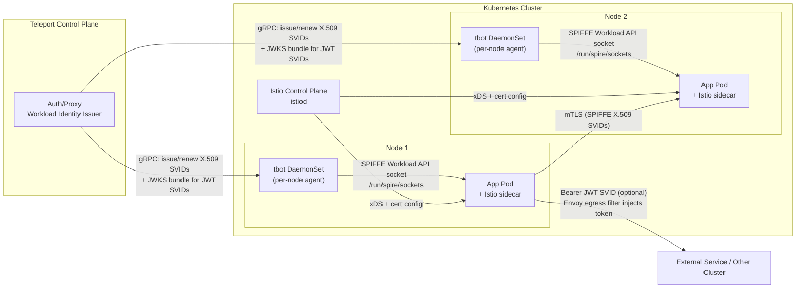

# Istio + Teleport Workload Identity (SPIFFE) – Deployment Diagram

Key points:
- tbot runs as a DaemonSet (one per node) and exposes the SPIFFE Workload API socket to pods on that node.
- Teleport issues and renews SVIDs (X.509, and JWT SVIDs on v16+) to tbot; JWKS is published by the proxy.
- Istio sidecars consume SPIFFE certs from the socket for mTLS; Istio control plane delivers xDS.
- Optional: for off-mesh/cross-cluster calls, an Envoy egress filter can inject a JWT SVID as a Bearer token.
