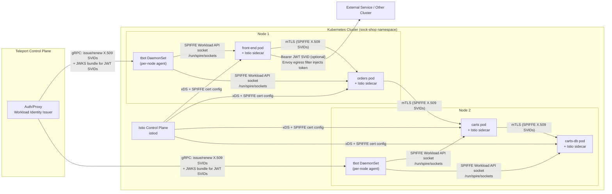

# Sock Shop on Istio + Teleport Workload Identity (SPIFFE)

Key points:
- Sock Shop pods run with Istio sidecars; identities come from Teleport via tbot DaemonSet sockets on each node.
- Teleport issues SPIFFE SVIDs (X.509; JWT SVIDs on v16+) to tbot. Istio uses them for service-to-service mTLS.
- The socket path `/run/spire/sockets` is hostPath-mounted into injected pods so Envoy can read SVIDs.
- Optional egress pattern: front-end can attach a JWT SVID for off-mesh calls via an Envoy egress filter and helper sidecar.
